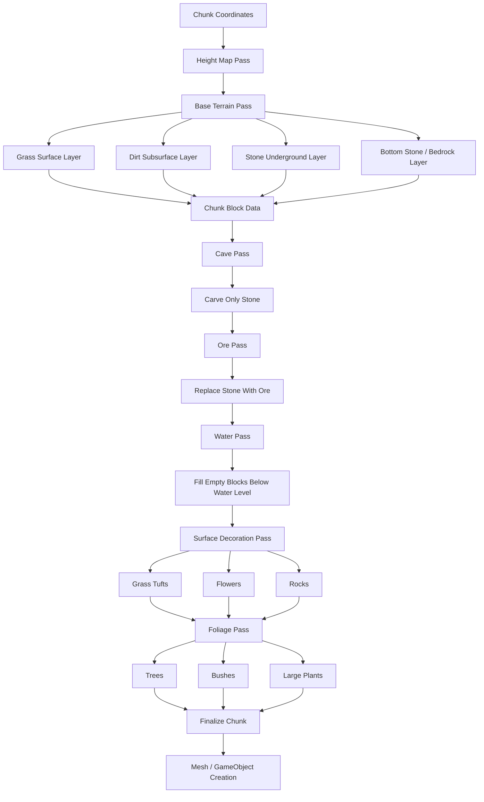
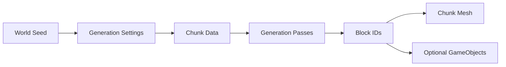

# Terrain Layering and Generation Pipeline

This document describes a scalable terrain layering approach for chunk-based world generation.

The goal is to avoid placing every terrain rule directly inside one large block loop. Instead, terrain generation should be treated as a sequence of independent generation passes.

Each pass has one responsibility and modifies lightweight chunk/block data before the final renderable blocks or meshes are created.

---

## Core Idea

Terrain generation should be split into two main concerns:

```text
Terrain shape
    Determines where terrain exists.

Terrain materials
    Determines what each block should be.
```

For example:

```text
Shape:
    - Column height
    - Cave positions
    - Terrain slope
    - Sea level
    - Mountain regions

Materials:
    - Grass
    - Dirt
    - Stone
    - Ore
    - Water
    - Foliage
```

This makes terrain easier to extend later with features such as ores, trees, flowers, water, snow, sand, or biome-specific surfaces.

---

## Recommended Generation Pipeline



---

## Layer Responsibilities

### 1. Height Map Pass

The height map pass decides the surface height for each `x/z` column.

It should answer:

```text
How tall is the terrain at this world position?
```

Typical inputs:

- World seed
- World `x/z` position
- 2D noise
- Biome data
- Terrain settings

Example output:

```text
Column at x=10, z=4 has surfaceY = 12
```

The height map pass should not decide whether a block is grass, dirt, stone, ore, or water. It only defines the terrain shape.

---

### 2. Base Terrain Pass

The base terrain pass creates the main solid terrain layers.

Recommended rule:

```text
Highest solid block     = Grass
3 blocks below surface  = Dirt
Everything below that   = Stone
Lowest level            = Stone or Bedrock
```

Conceptually:

```text
surfaceY        Grass
surfaceY - 1    Dirt
surfaceY - 2    Dirt
surfaceY - 3    Dirt
surfaceY - 4    Stone
surfaceY - 5    Stone
...
bottomY         Stone / Bedrock
```

This pass should create predictable base terrain before caves, ores, water, or decorations are added.

---

### 3. Cave Pass

The cave pass removes underground blocks based on 3D noise.

Important rule:

```text
Caves should only carve stone.
```

This prevents caves from cutting holes through grass and dirt surface layers unless that is intentionally desired.

Recommended cave rules:

```text
If block is Stone
And block is not the lowest layer
And cave noise is above threshold
Then replace block with Air
```

The lowest layer should usually remain solid to prevent chunks from having holes through the bottom.

---

### 4. Ore Pass

The ore pass replaces some stone blocks with ore blocks.

Important rule:

```text
Ores should replace stone, not grass or dirt.
```

Example rules:

```text
Coal:
    Allowed in stone
    Common
    Wide Y range

Iron:
    Allowed in stone
    Medium rarity
    Mid/deep Y range

Rare ore:
    Allowed in stone
    Low rarity
    Deep Y range
```

Ore generation can use:

- 3D noise
- Random chance
- Y-level ranges
- Vein size rules
- Biome-specific modifiers

---

### 5. Water Pass

The water pass fills empty spaces below a configured water level.

Recommended rule:

```text
If block is Air
And y is below or equal to waterLevel
Then place Water
```

This should usually happen after caves are carved, because caves below sea level may become flooded.

Water generation may also consider:

- Oceans
- Lakes
- Rivers
- Underground water
- Biome rules

---

### 6. Surface Decoration Pass

The surface decoration pass places small objects on top of terrain.

Examples:

- Grass tufts
- Flowers
- Pebbles
- Mushrooms
- Snow layers
- Fallen sticks

Recommended rule:

```text
If block is Grass
And space above is Air
And decoration noise/random allows it
Then place decoration above the grass block
```

Surface decorations should usually not replace the terrain block itself. They usually occupy the air block above the surface.

---

### 7. Foliage Pass

The foliage pass handles larger vegetation.

Examples:

- Trees
- Bushes
- Large plants
- Cacti
- Reeds

Tree placement usually needs more checks than small decorations:

```text
If block is Grass
And enough vertical space exists
And enough horizontal space exists
And tree noise/random allows it
Then place tree
```

Large foliage should be generated late because it may occupy several blocks.

---

## Recommended Pass Order

A practical order is:

```text
1. Height Map Pass
2. Base Terrain Pass
3. Cave Pass
4. Bottom Layer Pass
5. Ore Pass
6. Water Pass
7. Surface Decoration Pass
8. Foliage Pass
9. Final Mesh / GameObject Creation
```

A more abstract version:

```text
Shape
Material
Carving
Replacement
Fluid
Decoration
Finalization
```

---

## Why Use Passes?

Using generation passes keeps each system focused.

Instead of one huge method containing every rule:

```text
GenerateChunk()
    handles grass
    handles dirt
    handles stone
    handles caves
    handles ores
    handles water
    handles trees
    handles flowers
```

Prefer:

```text
HeightMapPass
BaseTerrainPass
CavePass
OrePass
WaterPass
DecorationPass
FoliagePass
```

This makes the world generator easier to extend, debug, test, and tune.

---

## Recommended Data Flow



The generator should ideally operate on lightweight block data first.

For example:

```text
BlockId.Grass
BlockId.Dirt
BlockId.Stone
BlockId.Air
BlockId.Water
BlockId.IronOre
```

After generation is complete, the engine can convert the chunk data into:

- A mesh
- Renderable chunk objects
- Physics colliders
- Optional `GameObject` instances for interactive blocks

This is usually better than creating one full `GameObject` for every block during terrain generation.

---

## Mental Model: Masks

A useful way to think about terrain features is through masks.

A mask defines where something is allowed to exist.

Examples:

```text
Grass mask:
    Only the highest solid block in a column

Dirt mask:
    Only the first 3 blocks below grass

Stone mask:
    Everything below dirt

Cave mask:
    Only stone blocks, excluding the bottom layer

Ore mask:
    Only stone blocks within allowed Y ranges

Water mask:
    Empty space below water level

Tree mask:
    Grass surface, enough empty space above, suitable random/noise value
```

This avoids messy conditionals and makes each terrain feature easier to reason about.

---

## Suggested Future Interfaces

Eventually, the terrain generator could be modeled around generation passes:

```csharp
public interface IChunkGenerationPass
{
    void Generate(ChunkGenerationContext context, ChunkData chunk);
}
```

Example passes:

```csharp
public sealed class HeightMapPass : IChunkGenerationPass;
public sealed class BaseTerrainPass : IChunkGenerationPass;
public sealed class CavePass : IChunkGenerationPass;
public sealed class OrePass : IChunkGenerationPass;
public sealed class WaterPass : IChunkGenerationPass;
public sealed class FoliagePass : IChunkGenerationPass;
```

The chunk generator then becomes a pipeline:

```csharp
foreach (IChunkGenerationPass pass in _passes)
{
    pass.Generate(context, chunk);
}
```

---

## Summary

Use a terrain generation pipeline where each layer or feature is handled by a dedicated pass.

Recommended structure:

```text
Height map decides shape.
Base terrain creates grass, dirt and stone.
Caves carve only stone.
Ores replace stone.
Water fills empty air below water level.
Decorations and foliage are placed last.
Final chunk data is converted into renderable meshes or objects.
```

This keeps the system flexible enough to support future terrain features such as foliage, water, ores, biomes, snow, rivers, and structures.
