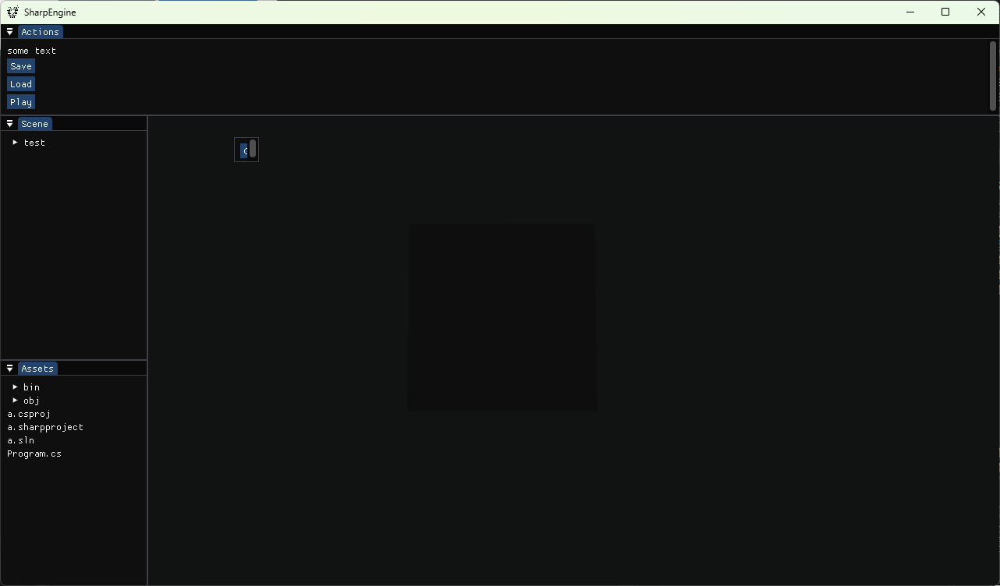
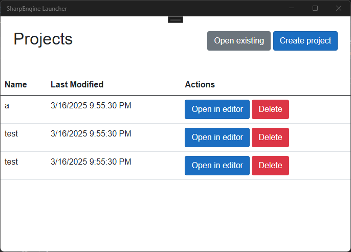

<h1 align="center">
    <a href="#"></a>
    SharpEngine    
</h1>
<div align="center">

[](https://www.nuget.org/packages/SharpEngine.Core.NET)


<!--


-->
</div>

## About

<i>SharpEngine</i> is a game engine written in purely in C# using [Silk.NET](https://github.com/dotnet/Silk.NET) as a wrapper for the graphics rendering pipeline. <i>SharpEngine</i> aims to enable developers to create <b>basic</b> applications using simple instructions or <b>advanced</b> applications by exposing <b>every</b> component.

<i>SharpEngine</i> tries not to do "<i>Magic Behind the Scenes</i> 🧙‍♂️✨". Developers create their applications using traditional .NET solutions. The engine components use `dotnet` commands to:
- Create projects
- Launch projects
- More in the future? ..

## Getting started
<h3 align="center"> All you need is the <a href="./Engine/SharpEngine.Core">Core</a>!</h3>

Using <i>SharpEngine</i>, you can create your applications using a <i>Standalone</i> approach, where all you need is a reference to the <i><a href="./Engine/SharpEngine.Core">SharpEngine.Core</a></i>. You can use a local project reference from the repo or add a NuGet package reference using `dotnet add package SharpEngine.Core.NET`.

After you have installed the NuGet package you initialize the <i>Game implementation</i>, <i>Scene</i> and <i>Window</i>:

```csharp
public static void Main(string[] args)
{
    var game = new Minimal(new DefaultSettings());
    var scene = new Scene();

    using var window = new SharpEngine.Core.Window(game.Camera, scene, game.Camera.Settings);
    window.Run();
}
```

```csharp
public class Minimal : Game
{
    public Minimal(ISettings settings)
    {
        CoreSettings = settings;
    }
}
```

# <h3 align="center">Maybe you want more?!</h3>

Developing multiple projects is easy with <i>SharpEngine</i>'s <i>Launcher</i> and <i>Editor</i> components. 

<small>I'm not a UI developer, I will make these prettier later I promise :)</small>

### Editor

The <i>Editor</i> supports dockable windows that can easily be customized using the [ImGui.NET](TODO) library. You can easily create new windows by implementing the `ImGuiWindowBase` class and letting the <i>Editor</i> handle the rest.

Currently the <i>Editor</i> contains 5 different windows:
- Actions Menu: Saves, loads and starts the game being edited.
- Assets window: Contains all the files (even in subdirectories) in the project directory.
- Context menu: Contains often used actions. Opened when you right-click anywhere in the <i>Editor</i>. 
- Properties window: Contains the properies of the active element.
- Scene window: Contains a tree view of all the nodes within the active scene.



### Launcher

The launcher is an interface for easily accessing your projects and managing the versions of the engine you have installed.



## Examples

- [A minimalistic project that only opens a window and prints <i>"Hello World"</i> to the console.](/Examples/Minimal/)
- [A Minecraft clone with 16^3 * 3 gubes with textures and basic lightning.](/Examples/MinecraftClone/)

## Roadmap and plans

The engine is still in it's infant phase where we are just barely hitting all required components working so that we can say the MVP version is done. The current plan is just to use the issues board and execute on that using the "waterfall" method where stuff is just thrown into the engine.

The long-term plan is to all the crucial functionalities we are still missing like:
- [#3](https://github.com/Av3boy/SharpEngine/issues/3) & [#2](https://github.com/Av3boy/SharpEngine/issues/2) Loading meshes from files 
- [#40](https://github.com/Av3boy/SharpEngine/issues/40) UI 
- [#17](https://github.com/Av3boy/SharpEngine/issues/17) Audio 
- [#15](https://github.com/Av3boy/SharpEngine/issues/15) Text renderer 
- [#13](https://github.com/Av3boy/SharpEngine/issues/13) Ray tracing 
- [#12](https://github.com/Av3boy/SharpEngine/issues/12) Particle system 

This is just a few among many known issues / missing features from the engine and these will be implemented whenever time permits and we apologize for any inconvenience for now :'D 

For more information about the future of the engine, see <i>[A Sharp Plan](https://github.com/users/Av3boy/projects/5)</i>.

## Contribution & other miscellaneous stuff

If you are interested in contributing to the project, see [Contribution](https://github.com/Av3boy/SharpEngine/blob/main/docs/CONTRIBUTING.md).

Icon created using the work of these lovely people:  
[Engine icon: Freepik](https://www.flaticon.com/free-icons/engine), [Shine icon: kornkun](https://www.flaticon.com/free-icons/shine)
